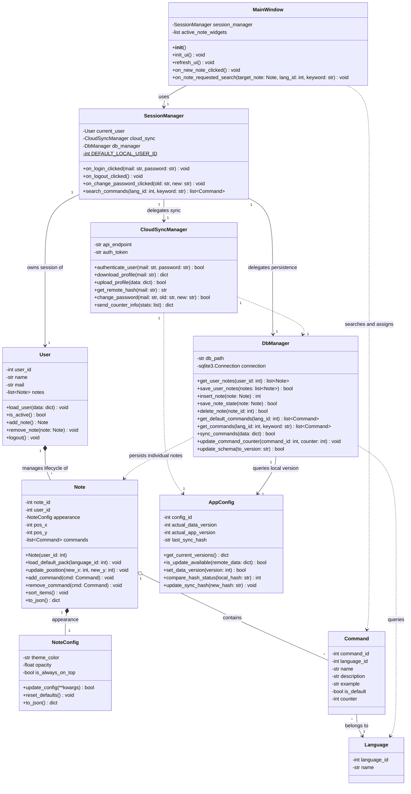
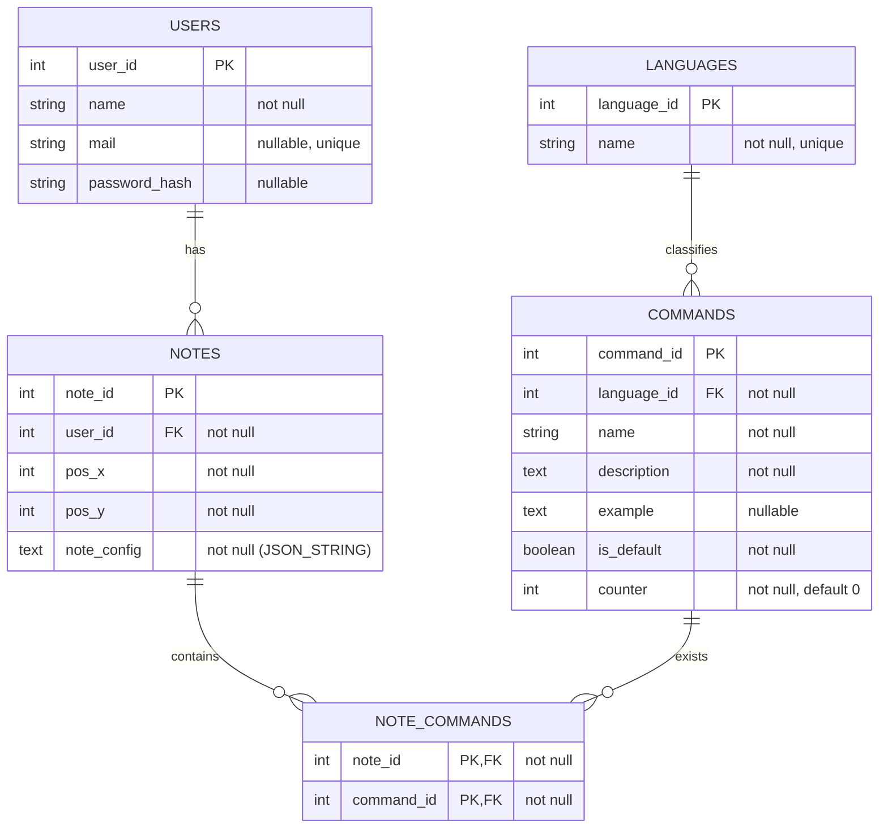
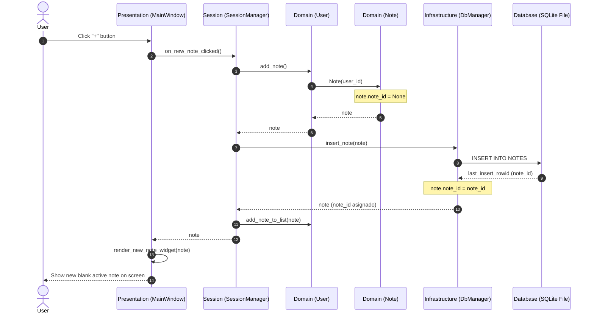
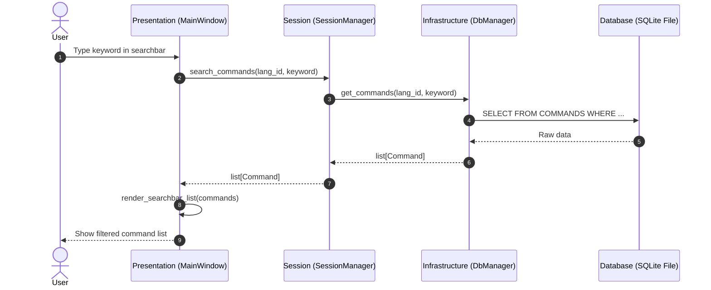
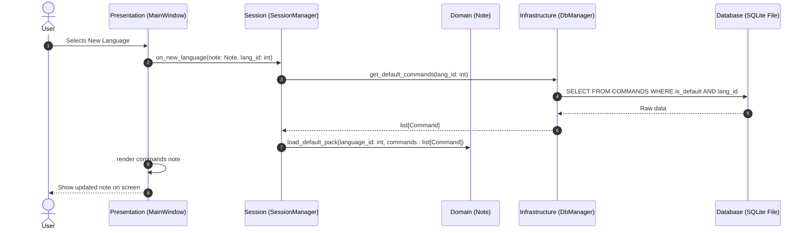

# Cheat Sheet Application

A desktop tool designed to remain visible in a corner of the screen while the user codes. It is aimed at programming students or developers learning a new language, framework, or technology, serving as a quick reference for commands without the need to switch windows.

Upon launching, the app does not present an empty search bar; instead, it displays one or more floating sticky notes containing the most frequently used commands for a specific technology. These notes correspond to the language or technology selected during the user's last session. Each entry displays the command alongside a concise explanation (e.g., `append` — adds an element to the end of a list).

Notes are the core element of the application. They support continuous scrolling to reveal all available commands. Users can fully customize them: adding new commands, removing unused ones, or mixing commands from different languages. The goal is for users to adapt these lists based on the commands they have not yet memorized, providing an immediate reminder without having to look up documentation or consult an AI.

In addition to the notes, the application includes a search engine. This allows users to find commands outside the active note and append them. It does not require exact matches: users can type descriptions in natural language—for instance, "delete dictionary"—to get relevant command suggestions. Once found, any command can be seamlessly added to the active note.

All data is stored locally to ensure the application is fast and fully functional offline. Optionally, data can be synchronized across multiple devices and updated to incorporate new languages or recent software versions.

The ultimate goal is to keep an editable, relevant, and concise list of commands permanently visible on the screen, backed by a search engine to expand or modify it as needed.

---

## 1. System Requirements Specification

### Functional Requirements (FR)
* **FR-01 Multi-language Library Management:** The system must be scalable to support N number of technologies through configuration files or database entries.
* **FR-02 Floating Interface (Sticky Mode):** The window must feature an "Always On Top" property, be resizable by the user, and include horizontal visual guide lines.
* **FR-03 Predictive Search:** A search engine capable of providing real-time suggestions based on the command library and descriptions.
* **FR-04 Active List Builder:** An interface to select commands from the search results and send them directly to the sticky note board.
* **FR-05 Logical Sorting:** Automated alphabetical ordering (A-Z) of the commands present within the active list.
* **FR-06 Local Persistence:** Storage of the session state so that the active list and interface configurations persist when the application is closed.
* **FR-07 Telemetry and Library Improvement:** The system must track the usage frequency of each command via a local counter and send this data anonymously to the cloud to identify the most relevant commands and optimize starter packs in future updates.
* **FR-08 Data Export and Import:** Manual backup capability of the command database into standard formats (JSON/CSV).
* **FR-09 Quick Editing:** Ability to briefly modify descriptions or tags directly from the sticky note interface.
* **FR-10 Element Removal:** The user must be able to remove commands from the active list via an action icon located next to the description.
* **FR-11 Authentication and Cloud Sync:**
  * User Login/Registration module.
  * Automatic synchronization of custom libraries, pinned commands, and interface settings to the cloud.
  * Multi-platform data recovery upon user login.
* **FR-12 Predefined Command Loading:** When activating a new technology, the system must automatically load a "Starter Pack" containing its most common and widely used commands.

### Non-Functional Requirements (NFR)
* **NFR-01 Portability:** Lightweight executable targeting desktop operating systems (Windows/Linux/macOS).
* **NFR-02 Resource Efficiency:** CPU consumption under 1% while in an idle state.
* **NFR-03 Usability:** A minimalist user interface that requires no more than 2 clicks for any primary action.

---

## 2. Architecture and Modeling

### Class Diagram

### Entity-Relationship Diagram (ERD)

---

## 3. Sequence Diagrams

### New Note Creation

### Command Search by Keyword

### Loading Default Command Packs

